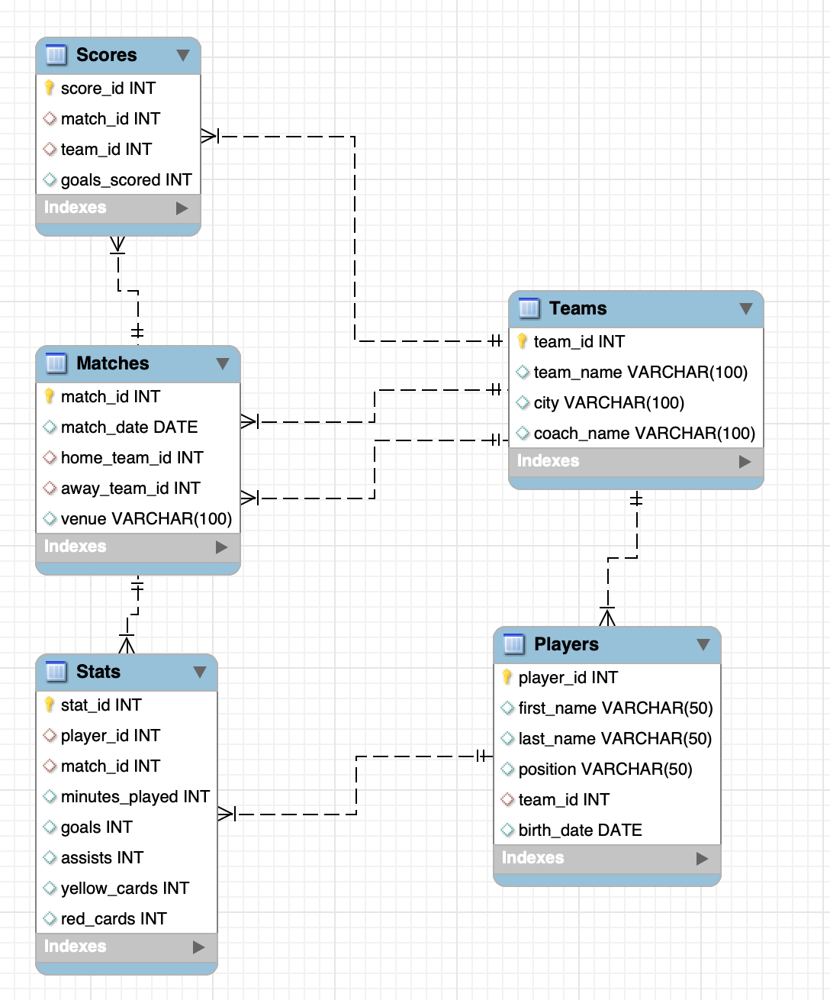
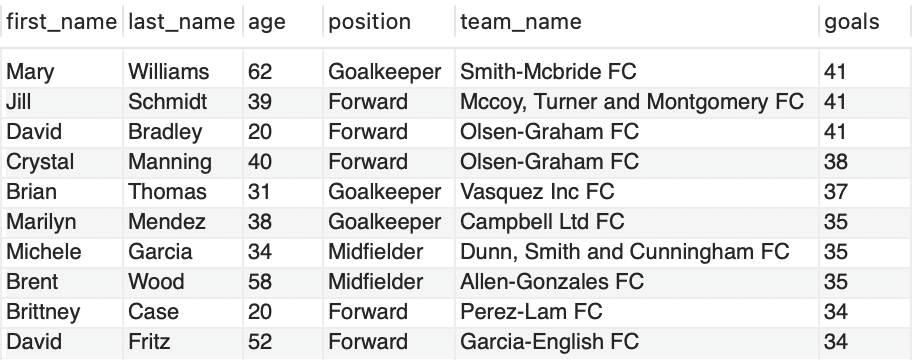
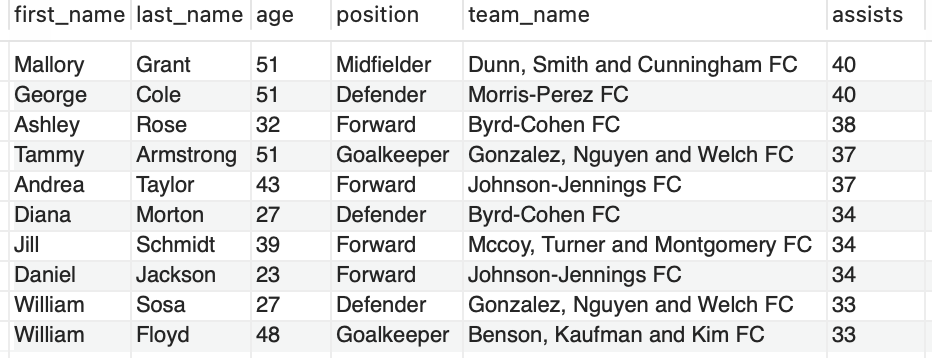
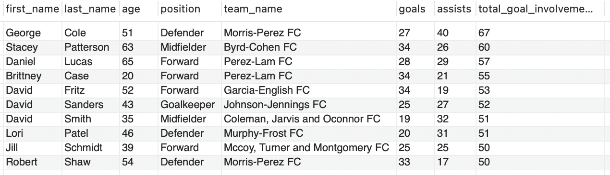
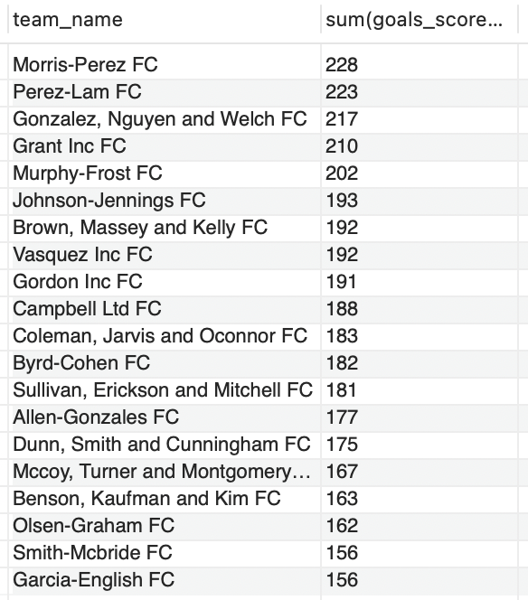
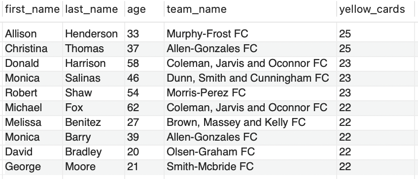
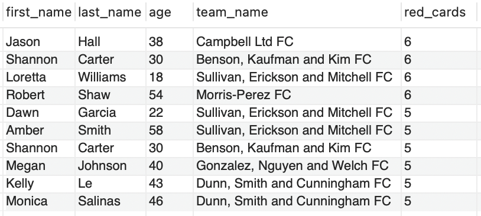

# Football-Analytics-Project


The purpose of this project was to practice and to showcase my knowledge of SQL. I created a database named Sports Analytics and used Python Faker to populate the tables with fake data. the python code (team_name = faker.company() + " FC") generated team names using company names and adding FC to the end of them. The end result of this name generation was 20 teams who sounded like they were law firms, and thus the ELFL (English Law Firms League) was born.

# Creating the database

I began by creating my database named 'Sports Analytics 2'(Sports Analytics 1 was a failed practice attempt). I created 5 tables in this database, listed below:

 - Players
 - Matches
 - Scores
 - Teams
 - Stats

Below is the code used to create the tables.

```
CREATE DATABASE SportsAnalytics;
USE SportsAnalytics;
```

## Teams Table
```
CREATE TABLE Teams (
	team_id INT AUTO_INCREMENT PRIMARY KEY,
	team_name VARCHAR(100),
	city VARCHAR(100),
	coach_name VARCHAR(100)
);
```

## Players Table
```
CREATE TABLE Players (
	player_id INT AUTO_INCREMENT PRIMARY KEY,
    first_name VARCHAR(50),
    last_name VARCHAR(50),
    position VARCHAR(50),
    team_id INT,
    birth_date DATE,
    FOREIGN KEY (team_id) REFERENCES Teams(team_id)
);
```

 ## Matches Table
 ```
CREATE TABLE Matches (
	match_id INT AUTO_INCREMENT PRIMARY KEY,
    match_date DATE,
    home_team_id INT,
    away_team_id INT,
    venue VARCHAR(100),
    FOREIGN KEY (home_team_id) REFERENCES Teams(team_id),
    FOREIGN KEY (away_team_id) REFERENCES Teams(team_id)
);
```

## Scores Table
```
CREATE TABLE Scores (
	score_id INT AUTO_INCREMENT PRIMARY KEY,
    match_id INT,
    team_id INT,
    goals_scored INT,
    FOREIGN KEY (match_id) REFERENCES Matches(match_id),
    FOREIGN KEY (team_id) REFERENCES Teams(team_id)
);
```

## Stats Table
```
CREATE TABLE Stats (
	stat_id INT AUTO_INCREMENT PRIMARY KEY,
    player_id INT,
    match_id INT,
    minutes_played INT,
    goals INT,
    assists INT,
    yellow_cards INT,
    red_cards INT,
    FOREIGN KEY (player_id) REFERENCES Players(player_id),
    FOREIGN KEY (match_id) REFERENCES Matches(match_id)
);
```

## Database Schema



The links between my tables are outlined in the above schema. The teams table is the main table, linking to 3 of the other 4 tables, though it has no direct link to the stats table.

## Populating the database with data

Next up I had to populate the tables with data and for this I chose to use Python Faker, which easily generates mock data for databases based on your defined criteria. I used Jupyter notebook for all of my python code in this project. I am still learning Python and am by no means an expert yet, I therefore asked chatgpt to help me write the code for this portion of the project.

## Importing Faker and Setting up Standard Deviation Parameters
```
import random
from faker import Faker

faker = Faker()

# Parameters for normal distribution
mean_goals = 5      # Average goals
stddev_goals = 10     # Spread around the mean for goals

mean_assists = 5     # Average assists
stddev_assists = 10    # Spread around the mean for assists

mean_yellow_cards = 10
stddev_yellow_cards = 4

mean_red_cards = 0
stddev_red_cards = 2
```
In this first part of the code I import the faker library and then set up the distribution parameters for the stats from the stats table. This was something I initially had some trouble with.

When I first tried to set this up, I did not include a normal (Gaussian) distribution model. Instead I said that the maximum amount of goals, assists and cards a player could get across the season was 100 of each. I wanted the league to be exciting and high scoring, so I also set up that the maximum amount of home and away goals in any one game could be 10.

Without the Gaussian distribution model, I had it set to be completely random, but when I imported this data and queried it I found that a large majority of players had maxxed out all of their stats with 100 goals, assists and cards, and no one had less than 50. The large amount of games and the cap on player stats meant many players were maxxing out and subsequent goals, assists etc were just being divided out amongst the remaining players.

Once I found out you could include a distribution model, the results became much more realistic. I set the mean number for each of the stats and below it I set the stddev value.

Mean yellow cards of 10 with an SD of 4 therefore meant that the normal range of the bell curve would be 6-14. Outliers above or below this range were rarer but not impossible.

## Generating Teams Data
```
# Step 1: Generate Teams
teams = []
for team_id in range(1, 21):  # 20 teams
    teams.append({
        "team_id": team_id,
        "team_name": faker.company() + " FC",
        "city": faker.city(),
        "coach_name": faker.name(),
         "points": 0,  # Initialize points,
        "matches_played": 0  # Initialize matches played
    })
```
The above code generated data for the teams table.

## Generating Players Data
```
# Step 2: Generate Players
players = []
player_id = 1
for team in teams:
    for _ in range(11):  # Each team gets 11 players
        players.append({
            "player_id": player_id,
            "first_name": faker.first_name(),
            "last_name": faker.last_name(),
            "position": random.choice(["Goalkeeper", "Defender", "Midfielder", "Forward"]),
            "team_id": team["team_id"],  # Link player to their team
            "birth_date": faker.date_of_birth(minimum_age=18, maximum_age=65)
        })
        player_id += 1
```
The above code generated data for the Players table.

## Generating Matches Data
```
# Step 3: Generate Matches
matches = []
match_id = 1
for home_team in teams:
    for away_team in teams:
        if home_team["team_id"] != away_team["team_id"]:  # Ensure no matches against itself
            matches.append({
                "match_id": match_id,
                "home_team_id": home_team["team_id"],
                "away_team_id": away_team["team_id"],
                "match_date": faker.date_between(start_date='-1y', end_date='today'),
                "venue": home_team["city"]  # Assume matches happen in the home team's city
            })
            match_id += 1
```
The above code generated data for the Matches table.

## Generating Scores Data
```
# Step 4: Generate Scores and Update Points
scores = []
score_id = 1
for match in matches:
    home_goals = random.randint(0, 10)  # Max home goals = 10
    away_goals = random.randint(0, 10)  # Max away goals = 10

    # Record the scores
    scores.append({
        "score_id": score_id,
        "match_id": match["match_id"],
        "team_id": match["home_team_id"],
        "goals_scored": home_goals
    })
    score_id += 1
```
The above code generated data for the Scores table. As you can see I began this part by defining that the maximum amount of home and away goals in a single match could be 10 (meaning maximum score could be 10-10).

## Generating Stats Data
```
# Step 5: Generate Stats for Players with Normal Distribution for Goals and Assists
stats = []
stat_id = 1
for match in matches:
    for team_id in [match["home_team_id"], match["away_team_id"]]:  # Home and Away teams
        relevant_players = [p for p in players if p["team_id"] == team_id]  # Players from the team
        for player in random.sample(relevant_players, random.randint(7, 11)):  # 7-11 players per team
            goals = int(random.gauss(mean_goals, stddev_goals))  # Goals scored by player
            assists = int(random.gauss(mean_assists, stddev_assists))  # Assists by player
            yellow_cards = int(random.gauss(mean_yellow_cards, stddev_yellow_cards))  # yellow cards by player
            red_cards = int(random.gauss(mean_red_cards, stddev_red_cards))  # red cards by player

            # Clip values to stay within a reasonable range (0-50 goals and assists)
            goals = max(0, min(100, goals))  # Ensuring goals are between 0 and 100
            assists = max(0, min(100, assists))  # Ensuring assists are between 0 and 100
            yellow_cards = max(0, min(40, yellow_cards))  # Ensuring yellow cards are between 0 and 40
            red_cards = max(0, min(60, red_cards))  # Ensuring red cards are between 0 and 60

            stats.append({
                "stat_id": stat_id,
                "player_id": player["player_id"],
                "match_id": match["match_id"],
                "minutes_played": random.randint(0, 90),
                "goals": goals,
                "assists": assists,
                "yellow_cards": yellow_cards,
                "red_cards": red_cards
            })
            stat_id += 1
```
This part of the code was more complex and incorporated the mean and SD values we previously defined.

The code specifies that 'Goals' (as an example) will be an integer number, and it's value will be defined by the random.gauss command used in conjunction with the parameters, mean & stddev.

The clip values define our maximum value limit. Taking the goals example again, the mean was 5 and the SD was 10, meaning 0-15 would fall within the normal distribution. The clip value of 100 meant that it was technically possible to reach 100 goals, though this would require an Erling Haaland type finisher in our humble league.

## Inserting Values into MySQL Database
```
# Insert Teams into MySQL, including points
for team in teams:
    query = """ INSERT INTO Teams (team_id, team_name, city, coach_name, points, matches_played) VALUES (%s, %s, %s, %s, %s, %s) """
    cursor.execute(query, (team["team_id"], team["team_name"],  team["city"], team["coach_name"],  team["points"],  # Insert points team["matches_played"]  # Insert matches_played))

# Insert Players
for player in players:
    query = "INSERT INTO Players (player_id, first_name, last_name, position, team_id, birth_date) VALUES (%s, %s, %s, %s, %s, %s)"
    cursor.execute(query, (player["player_id"], player["first_name"], player["last_name"], player["position"], player["team_id"], player["birth_date"]))

# Insert Matches
for match in matches:
    query = "INSERT INTO Matches (match_id, home_team_id, away_team_id, match_date, venue) VALUES (%s, %s, %s, %s, %s)"
    cursor.execute(query, (match["match_id"], match["home_team_id"], match["away_team_id"], match["match_date"], match["venue"]))

# Insert Scores
for score in scores:
    query = "INSERT INTO Scores (score_id, match_id, team_id, goals_scored) VALUES (%s, %s, %s, %s)"
    cursor.execute(query, (score["score_id"], score["match_id"], score["team_id"], score["goals_scored"]))

# Insert Stats
for stat in stats:
    query = "INSERT INTO Stats (stat_id, player_id, match_id, minutes_played, goals, assists, yellow_cards, red_cards) VALUES (%s, %s, %s, %s, %s, %s, %s, %s)"
    cursor.execute(query, (stat["stat_id"], stat["player_id"], stat["match_id"], stat["minutes_played"], stat["goals"], stat["assists"], stat["yellow_cards"], stat["red_cards"]))

connection.commit()
print("Data inserted successfully!")
```

The final step was to take this data that we had generated and actually populate the MySQL database with it.

# Querying the Data
Now at last we had a full database, it was time to start querying the data. 20 teams. 38 games each. 760 total matches. Who knows what drama took place in the 2023/2024 ELFL season. Who would win the race for the golden boot, or the coveted playmaker trophy? Who would take the unfortunate title of being the most booked player? And ultimately, who would be living out every child's dream and lifting the ELFL trophy. Read on to find out.

## ELFL Top Scorers 2023/2024
```
# Top Scorers
select players.first_name, players.last_name, TIMESTAMPDIFF(YEAR, birth_date, CURDATE()) AS age, players.position, 
teams.team_name, 
stats.goals
from players
join teams
on players.team_id = teams.team_id
join stats
on players.player_id = stats.player_id
order by stats.goals desc
limit 10;
```
For this code I joined the players, teams and stats table to create the results table. I included the players age by using TIMESTAMPDIFF(YEAR, birth_date, CURDATE()) as only their birth date was given in the table. This function takes the year from their birth date and compares it with the current year, 2024, with the difference being the age of the player. I also limited this list to 10 to see only the top 10 goalscorers across this marvellous season.



What a season it was for 62 year old Mary Williams! 41 goals over 38 games is an unbelievable strike rate and is made all the more impressive by the fact she's a goalkeeper. Her goalscoring heroics this season for Smith-McBride FC see her share the golden boot with Mccoy, Turner and Montgomery FC's 39 year old forward, Jill Schmidt, and Olsen-Graham FCs 20 year old up and coming striker, David Bradley.

## ELFL Top Assists 2023/2024
```
# Top Assists
select players.first_name, players.last_name, TIMESTAMPDIFF(YEAR, birth_date, CURDATE()) AS age, players.position, 
teams.team_name, 
stats.assists
from players
join teams
on players.team_id = teams.team_id
join stats
on players.player_id = stats.player_id
order by stats.assists desc
limit 10;
```
Modifying the goalscorers code just slightly allows us to see who our top assist makers were this season.



They say you really don't hit your playmaker peak until you hit your 50's and the 23/24 season refused to buck that trend with 3 of the top 4 in the assists charts aged between 50 and 60.

Ultimately this year's Playmaker award was shared between 2 of the league's finest. Mallory Grant had a stellar campaign for Dunn, Smith and Cunningham FC, and she was matched all the way by George Cole of Morris-Perez FC, with both recording 40 assists across the 38 games.

## Top Goal Involvements

For the goal involvement totals (goals + assists) I actually updated the stats table to include 'total_goal_involvements' as a column. The code for this is below:

```
ALTER TABLE stats
ADD COLUMN total_goal_involvements INT GENERATED ALWAYS AS (goals + assists) STORED;
```

I then used almost exactly the same code as I had done previously for goals and assists.

```
# Top Goal Involvements
select players.first_name, players.last_name, TIMESTAMPDIFF(YEAR, birth_date, CURDATE()) AS age, players.position, 
teams.team_name, 
stats.goals, stats.assists, stats.total_goal_involvements
from players
join teams
on players.team_id = teams.team_id
join stats
on players.player_id = stats.player_id
order by total_goal_involvements desc
limit 10;
```


It's that man again! Who else but George Cole to top our goal involvements list. He's already won the Playmaker award but adding his 27 goals to that puts him 7 clear of 63 year old Stacey Patterson in 2nd place. What would Morris-Perez FC do without him?

An honourable mention must also be made in this category to 43 year old goalkeeper David Sanders, with 25 goals and 27 assists contributing to a remarkable 52 total goal involvements. Great stuff.

## Top Scoring Teams
```
#Top Scoring Teams
select teams.team_name AS Team,  SUM(stats.goals) AS Total_Goals 
from teams
join players
on teams.team_id = players.team_id
join stats
on players.player_id = stats.player_id
group by team_name
order by SUM(stats.goals) desc;
```

In order to find the top scoring teams I used the above code, joining teams, players and stats, grouping by team name and then ordering by the sum of the goals.



Perez must be a lucky name in the ELFL as our top 2 highest scoring teams both seem to have had a Perez as a partner in their firm.

Morris-Perez FC, led by George Cole of course, top the chart with 228 goals across 38 games, for an average of 6 goals a game. Relentless stuff.


## Most Yellow Cards
```
# Yellow Cards
select players.first_name, players.last_name, TIMESTAMPDIFF(YEAR, birth_date, CURDATE()) AS age, teams.team_name, stats.yellow_cards
from players
join stats
on players.player_id = stats.player_id
join teams
on players.team_id = teams.team_id
order by stats.yellow_cards desc
limit 10;
```


Alison Henderson loves a tackle doesn't she? The 33 year old sweeper keeper can often be found far away from her goal, marauding around her team's half and scything down anyone who comes to close. Her 25 yellow cards put her joint top with Christina Thomas of Allen-Gonzlez FC.

##  Most Red Cards
```
# Red Cards
select players.first_name, players.last_name, TIMESTAMPDIFF(YEAR, birth_date, CURDATE()) AS age, teams.team_name, stats.red_cards
from players
join stats
on players.player_id = stats.player_id
join teams
on players.team_id = teams.team_id
order by stats.red_cards desc
limit 10;
```



The oppressive tactics employed by coach Whitney Delgado at Sullivan, Erickson and Mitchell FC sees 3 of their players in the top 6 for red cards. Unbelievably however, they are not the only team to have 3 players in the top 10, with Dunn, Smith and Cunningham FC also guilty of this appalling record.

Jason Hall, Shannon Carter, Loretta Williams & Robert Shaw share top spot equally with 6 red cards each.

## Total  Cards
```
ALTER TABLE stats
ADD COLUMN total_cards INT GENERATED ALWAYS AS (yellow_cards + red_cards) STORED;
```

## Game of the Season

As the maximum amount of goals for each team in any one game was 10, I wanted to see if any of the 760 games across the season resulted in a 10-10 draw, the highest possible score. To accomplish this I used the below code, selecting the sum of the goals scored and grouping by the match_id.

```
select match_id, sum(goals_scored) from scores
group by match_id
order by sum(goals_scored) desc;
```

The result showed me that just one game across the season has finished 10-10. Now that I knew the match_id was 345, I wrote the following code to see which teams were involved in this ELFL epic.

```
select * from matches
join scores
on matches.match_id = scores.match_id
where matches.match_id = 345;
```

The match took place at Anachester, the home stadium of team 19, and saw them take on team 3. A quick 'SELECT * FROM teams' showed me that this game was between Vasquez Inc FC and Benson, Kauffman and Kim FC. This represented quite a departure from the norm for Benson, Kauffman and Kim FC, who as we saw earlier, were among the lowest scorers in the division.


## Final League Table

So now finally we come to the league table. It's been a remarkable season, but only 1 team can finish first and lift the trophy in front of their adoring fans. Who will finish with the ultimate bragging rights? Read on to find out.

```
SELECT
    team_id,
    SUM(CASE WHEN result = 'Win' THEN 1 ELSE 0 END) AS wins,
    SUM(CASE WHEN result = 'Draw' THEN 1 ELSE 0 END) AS draws,
    SUM(CASE WHEN result = 'Loss' THEN 1 ELSE 0 END) AS losses
FROM (
    -- Results for home teams
    SELECT 
        m.home_team_id AS team_id,
        CASE 
            WHEN home.goals_scored > away.goals_scored THEN 'Win'
            WHEN home.goals_scored < away.goals_scored THEN 'Loss'
            ELSE 'Draw'
        END AS result
    FROM Matches m
    JOIN Scores home ON m.match_id = home.match_id AND m.home_team_id = home.team_id
    JOIN Scores away ON m.match_id = away.match_id AND m.away_team_id = away.team_id
    
    UNION ALL

    -- Results for away teams
    SELECT 
        m.away_team_id AS team_id,
        CASE 
            WHEN away.goals_scored > home.goals_scored THEN 'Win'
            WHEN away.goals_scored < home.goals_scored THEN 'Loss'
            ELSE 'Draw'
        END AS result
    FROM Matches m
    JOIN Scores home ON m.match_id = home.match_id AND m.home_team_id = home.team_id
    JOIN Scores away ON m.match_id = away.match_id AND m.away_team_id = away.team_id
) AS combined
GROUP BY team_id
ORDER BY wins DESC, draws DESC, losses ASC;
```

I puzzled over how to do this for a long time, as I had not included a results or points column in any of my initial tables. Eventually I decided on the above.

I used CASE statements for 3 of my select choices. This will give me a result of 3 columns titled 'Win', 'Lose' & 'Draw'. Each win, lose and draw is given a value of 1 and is summed up so that the final result in each column will be the respective summed totals of those results.

I then had to define what a win, loss and draw were in this context. I did this in two parts, collecting results for home teams and then away teams separately, before using the UNION ALL clause to join the results together.

For each match_id, the number of home goals was compared to the number of away goals and a result was determined by using the CASE statement we set up. home_goals > away_goals = home win etc.

Finally I grouped this by team_id and ordered by wins to get the final results.


